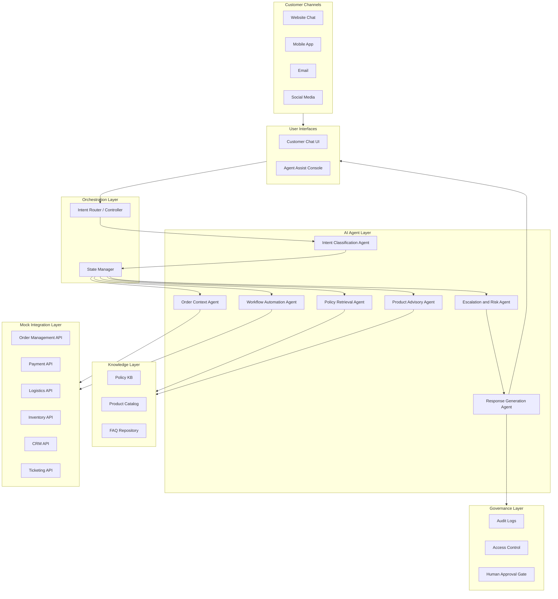
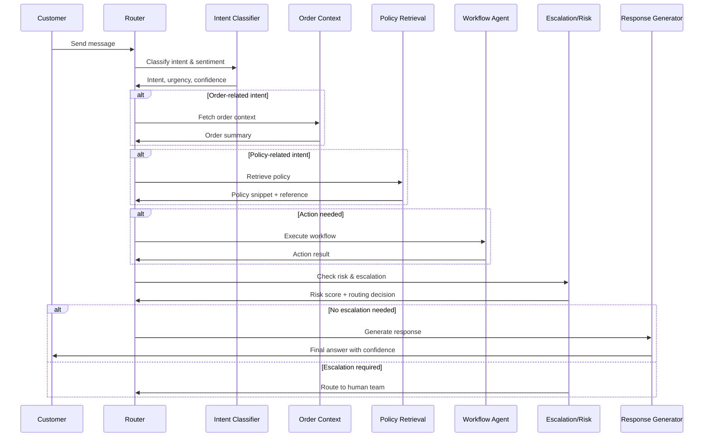

# ShopEase: Agentic AI-Powered Retail & E-commerce Customer Support System

## Overview

An intelligent, multi-agent AI system designed to transform customer support for **ShopEase Retail & Marketplace** — a fast-growing e-commerce company selling electronics, fashion, home goods, groceries, and lifestyle products across web, mobile, and physical stores.

The system uses specialized AI agents that collaborate to resolve customer issues: classifying intent, retrieving order context, interpreting policies, automating workflows, generating safe responses, and escalating complex cases to human teams.

## Business Problem

ShopEase handles thousands of daily customer interactions across chat, email, phone, and social channels. During promotions and festive sales, the support team struggles with:

- **Fragmented context** — customers repeat information across channels while agents manually search multiple systems
- **Slow resolution** — longer response times during peak traffic events
- **Inconsistent answers** — different agents give different policy guidance
- **High operational cost** — manual ticket handling and repeated escalations
- **Revenue leakage** — unresolved payment, refund, coupon, and return issues
- **Customer churn** — slow post-purchase support erodes loyalty

## Proposed Solution

A multi-agent orchestration system that:

1. Understands customer intent, urgency, and sentiment from natural language
2. Retrieves trusted information from order systems, product catalogs, and policy documents
3. Guides customers through self-service workflows (returns, refunds, invoices, etc.)
4. Provides support agents with summarized context, recommended responses, and next-best actions
5. Escalates sensitive cases (fraud, payment disputes, damaged high-value items) to the right human team
6. Maintains audit logs, confidence scores, and policy references for transparency

## High-Level Architecture



## Agent Roles

| Agent | Responsibility | Owner |
|-------|---------------|-------|
| **Intent Classification** | Identify customer goal, urgency, sentiment, and issue category | Person 1 |
| **Order Context** | Retrieve order, shipment, payment, invoice, return, and CRM history | Person 3 |
| **Policy Retrieval** | Search approved return, refund, warranty, delivery, and coupon policies | Person 2 |
| **Product Advisory** | Compare products, check compatibility, suggest alternatives | Person 4 |
| **Workflow Automation** | Initiate self-service actions (return, refund, invoice, ticket) | Person 3 |
| **Escalation & Risk** | Detect high-risk, low-confidence, or sensitive cases and route to humans | Person 5 |
| **Response Generation** | Create grounded, brand-aligned customer responses | Person 1 + Person 4 |

## Orchestration Flow



## Sample Use Cases

1. **Order Tracking** — "Where is my order?" retrieves shipment status and provides updated delivery estimate
2. **Return Request** — checks eligibility, explains conditions, initiates return workflow
3. **Product Comparison** — compares laptop specs for a college student and suggests best option
4. **Damaged Product** — collects evidence, verifies policy, escalates to replacement team
5. **Coupon Issue** — checks coupon terms, cart eligibility, explains why it wasn't applied
6. **Agent Assist** — summarizes order history, previous contacts, and recommends next action
7. **Lost Shipment** — flags as high priority, routes to logistics and fraud review

## Tech Stack

| Layer | Technology |
|-------|-----------|
| Language | Python 3.12+ |
| LLM Framework | LangChain / LangGraph |
| Vector Store | FAISS / ChromaDB (for RAG) |
| Backend API | FastAPI |
| Frontend | Streamlit / Gradio (prototype) |
| Data | JSON mock APIs, CSV datasets |
| Testing | pytest |
| Version Control | Git + GitHub |

## What is Where — Project Map

| File / Folder | What It Does | Owner |
|---------------|-------------|-------|
| **`src/orchestrator/graph.py`** | The main LangGraph workflow — connects all agents into a pipeline | Person 1 |
| **`src/orchestrator/state.py`** | Shared state schema (TypedDict) that flows between all agents | Person 1 |
| **`src/orchestrator/router.py`** | Routing logic — decides which agents to call based on intent | Person 1 |
| **`src/orchestrator/evaluator.py`** | Quality gate — checks confidence and completeness before responding | Person 1 |
| **`src/agents/intent_classifier.py`** | Classifies customer intent, sentiment, urgency using OpenAI | Person 1 |
| **`src/agents/response_generator.py`** | Generates grounded, policy-cited customer responses | Person 1 + 4 |
| **`src/agents/order_context.py`** | Retrieves order/payment/shipment data for the customer | Person 3 |
| **`src/agents/policy_retrieval.py`** | Searches policy KB and returns relevant rules with citations | Person 2 |
| **`src/agents/product_advisory.py`** | Compares products, suggests alternatives, checks stock | Person 4 |
| **`src/agents/workflow_automation.py`** | Executes actions: return, refund check, ticket creation | Person 3 |
| **`src/agents/escalation_risk.py`** | Risk scoring and escalation routing to human teams | Person 5 |
| **`src/utils/`** | Helper functions: logging, validation, formatting, retry, metrics | Shared |
| **`src/config.py`** | API keys, model config, confidence thresholds | Person 1 |
| **`src/main.py`** | Demo runner — runs sample conversations through the full pipeline | Person 1 |
| **`src/knowledge/`** | Policy documents, product catalog, FAQs (knowledge base) | Person 2 |
| **`src/integrations/mock_apis/`** | Mock backend APIs (orders, payments, logistics, CRM) | Person 3 |
| **`src/ui/customer_chat/`** | Customer-facing chat interface (Streamlit) | Person 4 |
| **`src/ui/agent_console/`** | Internal agent-assist dashboard | Person 4 |
| **`src/governance/`** | Audit logs, access control, human approval gates | Person 5 |
| **`data/mock/`** | Sample orders, customers, and demo conversations | Person 3 |
| **`tests/`** | Evaluation suite, test cases, metrics | Person 5 |
| **`docs/architecture.md`** | Full system architecture with agent contracts and state schema | Person 1 |
| **`docs/team_guides/`** | Detailed step-by-step guides for each team member | Person 1 |
| **`CONTRIBUTING.md`** | How to clone, setup, and start contributing | Person 1 |

## How It All Connects

```
Customer sends message
       │
       ▼
 Intent Classifier ──→ "What do they want? How do they feel?"
       │
       ▼
 Router decides ──→ "Which agents do I need for this intent?"
       │
  ┌────┼────┬────────────┐
  ▼    ▼    ▼            ▼
Order Policy Product  Workflow    ← teammates build these
  │    │    │            │
  └────┼────┴────────────┘
       │
       ▼
 Evaluator ──→ "Do we have enough info? Is quality OK?"
       │
       ▼
 Risk Check ──→ "Safe to answer? Or escalate to human?"
       │
  ┌────┴────┐
  ▼         ▼
Response  Escalation
  │         │
  ▼         ▼
Customer gets answer or specialist takes over
```

## Team Roles

| Person | Role | Primary Ownership |
|--------|------|-------------------|
| Person 1 | Project Lead + Orchestration Architect | Architecture, agent router, state schema, integration |
| Person 2 | Knowledge Base + Policy Retrieval Engineer | Policy KB, FAQ, product catalog, RAG retrieval |
| Person 3 | Mock API + Workflow Automation Engineer | Mock APIs, order context agent, workflow automation |
| Person 4 | Product Advisory + UI/UX Engineer | Customer chat UI, agent console, product advisory agent |
| Person 5 | Escalation, QA, Evaluation + Presentation Lead | Risk agent, audit logs, testing, metrics, final deck |

## 6-Day Execution Timeline

| Day | Theme | Key Output | Who Drives |
|-----|-------|-----------|-----------|
| Day 1 | Scope + Design | Use cases, architecture, mock data schema, repo setup | Person 1 |
| Day 2 | Data + Agent Skeletons | KB, mock APIs, intent/order/policy agents running | Person 2 + 3 |
| Day 3 | Core Agents | All 7 agents with real logic, integrated flows | All |
| Day 4 | UI + Integration | Customer chat + agent console + audit logs | Person 4 + 5 |
| Day 5 | Evaluation + Fixes | Test report, metrics, refined flows, bug fixes | Person 5 + All |
| Day 6 | Final Packaging | Presentation, demo script, final report | Person 5 leads |

## Getting Started

### Prerequisites

- Python 3.12+
- Git

### Setup

```bash
git clone https://github.com/Ashish-training-droid/Agentic-AI-Powered-Retail-E-commerce-Customer-Support-System.git
cd Agentic-AI-Powered-Retail-E-commerce-Customer-Support-System
python -m venv venv
venv\Scripts\activate       # Windows
pip install -r requirements.txt
```

### Running the Demo

```bash
# Run all 7 demo conversations (works in mock mode, no API key needed)
set USE_MOCK=true
python -m src.main

# Run a specific demo scenario (1-7)
python -m src.main --demo 1    # Order tracking
python -m src.main --demo 2    # Return request
python -m src.main --demo 3    # Product comparison
python -m src.main --demo 4    # Damaged product (escalation)
python -m src.main --demo 5    # Coupon issue
python -m src.main --demo 6    # Refund status
python -m src.main --demo 7    # General FAQ
```

## Source Code Reference — File-by-File Guide

### Entry Point

| File | Purpose |
|------|---------|
| `src/main.py` | **Demo runner** — loads sample conversations from `data/mock/sample_conversations.json`, feeds each message through the full LangGraph pipeline, and prints step-by-step results (intent, order context, policy, workflow action, quality score, risk assessment, and final response). Supports running all 7 demos or a single one via `--demo N`. |

### Configuration

| File | Purpose |
|------|---------|
| `src/config.py` | **Central configuration** — loads environment variables (`OPENAI_API_KEY`, `OPENAI_MODEL`, `USE_MOCK`), defines confidence thresholds for routing/evaluation/response serving, and lists all supported intents, sentiments, urgency levels, and channels used across the system. |

### Orchestration Layer (`src/orchestrator/`)

| File | Purpose |
|------|---------|
| `src/orchestrator/state.py` | **Shared state schema** — defines the `AgentState` TypedDict that flows through the entire pipeline. Every field an agent reads or writes is declared here (input fields, intent output, order context, policy snippets, product context, workflow results, risk scores, response text, quality scores, and audit trail). |
| `src/orchestrator/graph.py` | **LangGraph workflow builder** — constructs and compiles the state graph connecting all agent nodes. Wraps every agent with an `error_safe` decorator so a single agent failure never crashes the pipeline. Defines the clarification node (low confidence) and escalation node (high risk). Wires the full flow: `START → classify_intent → [route] → context agents → evaluate → check_risk → generate_response / escalate → END`. |
| `src/orchestrator/router.py` | **Routing logic** — the "brain" that decides which agents to invoke after each step. Contains the intent-to-agent routing table, confidence-based routing (clarify if < 0.4, proceed if >= 0.7), missing-data checks (skip order agent if no order ID), and four conditional-edge functions (`route_after_intent`, `route_after_order`, `route_after_policy`, `route_after_risk`). |
| `src/orchestrator/evaluator.py` | **Quality gate** — runs after context-gathering agents and before response generation. Checks intent confidence, order context availability, policy retrieval completeness, product data presence, agent errors in the audit trail, and workflow action failures. Outputs a composite `quality_score` (0–1) and a list of `quality_issues`. |

### Agent Layer (`src/agents/`)

| File | Purpose |
|------|---------|
| `src/agents/intent_classifier.py` | **Intent Classification Agent** — classifies the customer message into one of 9 supported intents (order_tracking, return_request, refund_status, product_inquiry, warranty, coupon_issue, delivery_complaint, damaged_product, general_faq). Also detects sentiment (positive/neutral/negative/angry), urgency (low/medium/high/critical), and outputs a confidence score. Uses OpenAI function calling in live mode and keyword-based mock classification when `USE_MOCK=true`. |
| `src/agents/order_context.py` | **Order Context Agent** — retrieves unified order, shipment, payment, and CRM history for a customer. Tries to find order by direct order ID, then falls back to customer ID lookup. Returns structured order data (status, items, payment, shipment tracking, return history, CRM notes, customer tier) or an empty context with a clear "not found" signal. Currently uses a mock database. |
| `src/agents/policy_retrieval.py` | **Policy Retrieval Agent** — searches the policy knowledge base and returns matched policy snippets with reference IDs and confidence scores. Covers return, refund, warranty, coupon, delivery, and damaged-product policies. Currently uses keyword-to-policy lookup (to be replaced with RAG/vector retrieval). |
| `src/agents/product_advisory.py` | **Product Advisory Agent** — compares products, checks stock availability, and provides recommendations. Matches product keywords from the customer message against a mock product catalog (laptops, headphones) and returns side-by-side comparisons with specs, prices, ratings, and a recommendation summary. |
| `src/agents/workflow_automation.py` | **Workflow Automation Agent** — executes self-service actions based on intent: initiates returns, checks refund status, generates invoice links, creates support tickets, and updates shipping addresses. Flags sensitive high-value actions for human approval. Currently uses mock action functions. |
| `src/agents/escalation_risk.py` | **Escalation & Risk Agent** — evaluates risk using rule-based scoring (angry sentiment + high-value order, damaged high-value product, low classification confidence, lost shipment). Assigns a risk score (0–1), determines if escalation is required, and routes to the correct human team (fraud_review, refund_specialist, replacement_team, logistics, senior_agent) with a priority level (P1–P4). |
| `src/agents/response_generator.py` | **Response Generation Agent** — creates the final customer-facing response using all gathered context. Handles fallback scenarios (missing order data, no policy match, agent errors) with helpful fallback messages. In live mode, uses OpenAI to generate policy-grounded, channel-adapted, brand-aligned responses with cited references. In mock mode, uses template-based responses per intent. |

### Utility Layer (`src/utils/`)

| File | Purpose |
|------|---------|
| `src/utils/__init__.py` | **Package exports** — re-exports all utility functions for convenient importing (`from src.utils import get_logger, format_currency`, etc.). |
| `src/utils/logger.py` | **Structured logging** — provides `get_logger()` to create named loggers with both console and file output (`logs/system.log`), and `log_agent_step()` for standardized agent-level log entries with timestamps. |
| `src/utils/formatters.py` | **Display formatting** — `format_currency()` for INR/USD amounts, `format_timestamp()` for human-readable dates, `truncate_text()` for length-limited output, `format_agent_chain()` for pipeline visualization, `format_order_summary()` for one-line order summaries, and `mask_sensitive()` for masking card numbers and tokens. |
| `src/utils/validators.py` | **Input validation** — validates order IDs (`SE10234` format), customer IDs (`CUST_1001` format), intents, sentiments, urgency levels, channels, and confidence scores. Also provides `sanitize_user_input()` to strip dangerous characters and enforce length limits, and `extract_order_id_from_message()` to pull order IDs from free-text messages. |
| `src/utils/retry.py` | **Retry & error handling** — `retry_with_backoff()` decorator for exponential backoff on API calls, `graceful_fallback()` decorator to catch exceptions and return safe defaults, and `classify_error()` to categorize exceptions (api_error, timeout_error, auth_error, etc.) for metrics and routing. |
| `src/utils/metrics.py` | **Performance tracking** — `track_latency` decorator to measure agent execution time, `AgentMetrics` / `SessionMetrics` dataclasses for per-agent and per-session stats, `compute_resolution_metrics()` to aggregate batch results (resolution rate, escalation rate, avg confidence, intent distribution), and `get_agent_metrics()` / `reset_metrics()` for runtime inspection. |
| `src/utils/session.py` | **Session management** — `generate_session_id()` creates unique session IDs, `build_initial_state()` constructs a clean `AgentState` from raw customer input (sanitizes message, extracts order ID, sets defaults), and `append_to_history()` adds timestamped entries to conversation history. |

## License

This project is developed as a capstone for academic purposes.
