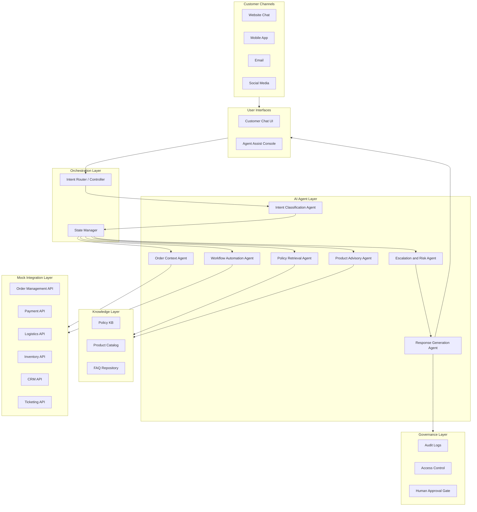
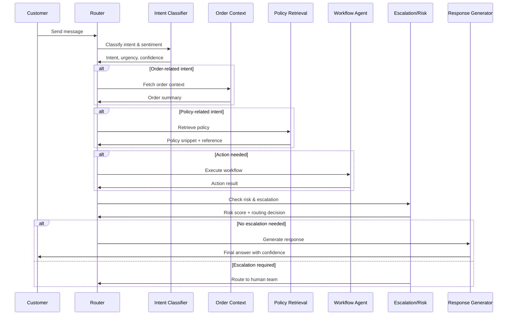

# ShopEase: Agentic AI-Powered Retail & E-commerce Customer Support System

## Overview

An intelligent, multi-agent AI system designed to transform customer support for **ShopEase Retail & Marketplace** — a fast-growing e-commerce company selling electronics, fashion, home goods, groceries, and lifestyle products across web, mobile, and physical stores.

The system uses specialized AI agents that collaborate to resolve customer issues: classifying intent, retrieving order context, interpreting policies, automating workflows, generating safe responses, and escalating complex cases to human teams.

## Business Problem

ShopEase handles thousands of daily customer interactions across chat, email, phone, and social channels. During promotions and festive sales, the support team struggles with:

- **Fragmented context** — customers repeat information across channels while agents manually search multiple systems
- **Slow resolution** — longer response times during peak traffic events
- **Inconsistent answers** — different agents give different policy guidance
- **High operational cost** — manual ticket handling and repeated escalations
- **Revenue leakage** — unresolved payment, refund, coupon, and return issues
- **Customer churn** — slow post-purchase support erodes loyalty

## Proposed Solution

A multi-agent orchestration system that:

1. Understands customer intent, urgency, and sentiment from natural language
2. Retrieves trusted information from order systems, product catalogs, and policy documents
3. Guides customers through self-service workflows (returns, refunds, invoices, etc.)
4. Provides support agents with summarized context, recommended responses, and next-best actions
5. Escalates sensitive cases (fraud, payment disputes, damaged high-value items) to the right human team
6. Maintains audit logs, confidence scores, and policy references for transparency

## High-Level Architecture



## Agent Roles

| Agent | Responsibility | Owner |
|-------|---------------|-------|
| **Intent Classification** | Identify customer goal, urgency, sentiment, and issue category | Person 1 |
| **Order Context** | Retrieve order, shipment, payment, invoice, return, and CRM history | Person 3 |
| **Policy Retrieval** | Search approved return, refund, warranty, delivery, and coupon policies | Person 2 |
| **Product Advisory** | Compare products, check compatibility, suggest alternatives | Person 4 |
| **Workflow Automation** | Initiate self-service actions (return, refund, invoice, ticket) | Person 3 |
| **Escalation & Risk** | Detect high-risk, low-confidence, or sensitive cases and route to humans | Person 5 |
| **Response Generation** | Create grounded, brand-aligned customer responses | Person 1 + Person 4 |

## Orchestration Flow



## Sample Use Cases

1. **Order Tracking** — "Where is my order?" retrieves shipment status and provides updated delivery estimate
2. **Return Request** — checks eligibility, explains conditions, initiates return workflow
3. **Product Comparison** — compares laptop specs for a college student and suggests best option
4. **Damaged Product** — collects evidence, verifies policy, escalates to replacement team
5. **Coupon Issue** — checks coupon terms, cart eligibility, explains why it wasn't applied
6. **Agent Assist** — summarizes order history, previous contacts, and recommends next action
7. **Lost Shipment** — flags as high priority, routes to logistics and fraud review

## Tech Stack

| Layer | Technology |
|-------|-----------|
| Language | Python 3.12+ |
| LLM Framework | LangChain / LangGraph |
| Vector Store | FAISS / ChromaDB (for RAG) |
| Backend API | FastAPI |
| Frontend | Streamlit / Gradio (prototype) |
| Data | JSON mock APIs, CSV datasets |
| Testing | pytest |
| Version Control | Git + GitHub |

## Project Structure

```
├── README.md
├── docs/
│   └── architecture.md
├── src/
│   ├── agents/
│   │   ├── intent_classifier.py
│   │   ├── order_context.py
│   │   ├── policy_retrieval.py
│   │   ├── product_advisory.py
│   │   ├── workflow_automation.py
│   │   ├── escalation_risk.py
│   │   └── response_generation.py
│   ├── orchestrator/
│   │   ├── router.py
│   │   └── state.py
│   ├── knowledge/
│   │   ├── policies/
│   │   ├── products/
│   │   └── faqs/
│   ├── integrations/
│   │   └── mock_apis/
│   ├── ui/
│   │   ├── customer_chat/
│   │   └── agent_console/
│   └── governance/
│       └── audit.py
├── tests/
├── data/
│   └── mock/
├── requirements.txt
└── .gitignore
```

## Team Roles

| Person | Role | Primary Ownership |
|--------|------|-------------------|
| Person 1 | Project Lead + Orchestration Architect | Architecture, agent router, state schema, integration |
| Person 2 | Knowledge Base + Policy Retrieval Engineer | Policy KB, FAQ, product catalog, RAG retrieval |
| Person 3 | Mock API + Workflow Automation Engineer | Mock APIs, order context agent, workflow automation |
| Person 4 | Product Advisory + UI/UX Engineer | Customer chat UI, agent console, product advisory agent |
| Person 5 | Escalation, QA, Evaluation + Presentation Lead | Risk agent, audit logs, testing, metrics, final deck |

## 6-Day Timeline

| day | Theme | Key Output |
|------|-------|-----------|
| 1 | Scope + Design | Use cases, architecture, mock data schema |
| 2 | Data + Agent Skeletons | KB, mock APIs, intent/order/policy agents |
| 3 | Core Agents | Order, policy, workflow, product, risk agents |
| 4 | UI + Integration | Customer chat + agent console + audit logs |
| 5 | Evaluation + Fixes | Test report and refined flows |
| 6 | Final Packaging | Presentation, demo script, final report |

## Getting Started

### Prerequisites

- Python 3.12+
- Git

### Setup

```bash
git clone https://github.com/Ashish-training-droid/Agentic-AI-Powered-Retail-E-commerce-Customer-Support-System.git
cd Agentic-AI-Powered-Retail-E-commerce-Customer-Support-System
python -m venv venv
venv\Scripts\activate       # Windows
pip install -r requirements.txt
```

### Running (coming soon)

```bash
python -m src.orchestrator.router
```

## License

This project is developed as a capstone for academic purposes.
