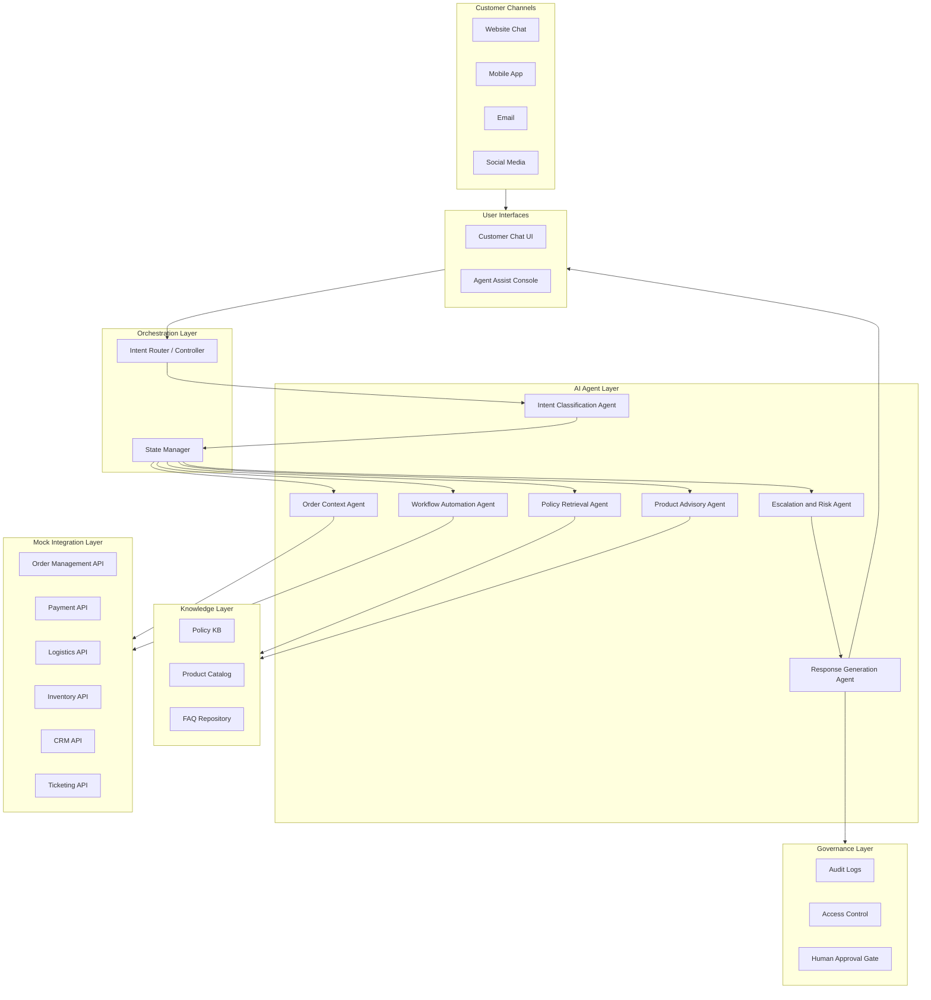

# ShopEase: Agentic AI-Powered Retail & E-commerce Customer Support System

## Overview

An intelligent, multi-agent AI system designed to transform customer support for **ShopEase Retail & Marketplace** — a fast-growing e-commerce company selling electronics, fashion, home goods, groceries, and lifestyle products across web, mobile, and physical stores.

The system uses specialized AI agents that collaborate to resolve customer issues: classifying intent, retrieving order context, interpreting policies, automating workflows, generating safe responses, and escalating complex cases to human teams.

## Business Problem

ShopEase handles thousands of daily customer interactions across chat, email, phone, and social channels. During promotions and festive sales, the support team struggles with:

- **Fragmented context** — customers repeat information across channels while agents manually search multiple systems
- **Slow resolution** — longer response times during peak traffic events
- **Inconsistent answers** — different agents give different policy guidance
- **High operational cost** — manual ticket handling and repeated escalations
- **Revenue leakage** — unresolved payment, refund, coupon, and return issues
- **Customer churn** — slow post-purchase support erodes loyalty

## Proposed Solution

A multi-agent orchestration system that:

1. Understands customer intent, urgency, and sentiment from natural language
2. Retrieves trusted information from order systems, product catalogs, and policy documents
3. Guides customers through self-service workflows (returns, refunds, invoices, etc.)
4. Provides support agents with summarized context, recommended responses, and next-best actions
5. Escalates sensitive cases (fraud, payment disputes, damaged high-value items) to the right human team
6. Maintains audit logs, confidence scores, and policy references for transparency

## High-Level Architecture



## How It All Connects

```
Customer sends message
       |
       v
 Intent Classifier --> "What do they want? How do they feel?"
       |
       v
 Router decides --> "Which agents do I need for this intent?"
       |
  +----+----+------------+
  v    v    v            v
Order Policy Product  Workflow
  |    |    |            |
  +----+----+------------+
       |
       v
 Evaluator --> "Do we have enough info? Is quality OK?"
       |
       v
 Risk Check --> "Safe to answer? Or escalate to human?"
       |
  +----+----+
  v         v
Response  Escalation
  |         |
  v         v
Customer gets answer or specialist takes over
```

## Agent Roles

| Agent | Responsibility | Owner |
|-------|---------------|-------|
| **Intent Classification** | Identify customer goal, urgency, sentiment, confidence | Ashish |
| **Order Context** | Retrieve order, shipment, payment, CRM history | Pallavi |
| **Policy Retrieval** | Search approved policies, return matched rules with citations | Gunjan |
| **Product Advisory** | Compare products, suggest alternatives, check stock | Aditi |
| **Workflow Automation** | Execute actions (return, refund, ticket, invoice) | Pallavi |
| **Escalation & Risk** | Multi-factor risk scoring, HITL approval queue, routing | Rohan |
| **Response Generation** | Grounded, policy-cited customer responses | Ashish + Aditi |

## Tech Stack

| Layer | Technology |
|-------|-----------|
| Language | Python 3.12+ |
| LLM | OpenAI GPT-4o (classification + response generation) |
| Embeddings | OpenAI text-embedding-3-small (semantic policy search) |
| Orchestration | LangGraph (multi-agent state graph) |
| RAG | Vector embeddings with cosine similarity for policy retrieval |
| Frontend | Streamlit (customer chat + agent console + HITL queue) |
| Data | JSON mock APIs (55 customers, 140+ orders, 23 policies) |
| Testing | pytest + custom evaluation harness |
| CI/CD | GitHub Actions (auto-test on push) |
| Version Control | Git + GitHub |

## What is Where — Project Map

| File / Folder | What It Does | Owner |
|---------------|-------------|-------|
| **`src/orchestrator/graph.py`** | LangGraph workflow — connects all agents into a pipeline | Ashish |
| **`src/orchestrator/state.py`** | Shared state schema (TypedDict) that flows between all agents | Ashish |
| **`src/orchestrator/router.py`** | Routing logic — decides which agents to call based on intent | Ashish |
| **`src/orchestrator/evaluator.py`** | Quality gate — checks confidence and completeness before responding | Ashish |
| **`src/agents/intent_classifier.py`** | Classifies customer intent, sentiment, urgency using OpenAI | Ashish |
| **`src/agents/response_generator.py`** | Generates grounded, policy-cited customer responses | Ashish + Aditi |
| **`src/agents/order_context.py`** | Retrieves order/payment/shipment data for the customer | Pallavi |
| **`src/agents/policy_retrieval.py`** | Searches policy KB using embeddings (LIVE) or keywords (MOCK) | Gunjan + Ashish |
| **`src/knowledge/embedding_store.py`** | RAG vector store — embeds 23 policies, finds nearest match by cosine similarity | Ashish |
| **`src/agents/product_advisory.py`** | Compares products, suggests alternatives, checks stock | Aditi |
| **`src/agents/workflow_automation.py`** | Executes actions: return, refund check, ticket creation | Pallavi |
| **`src/agents/escalation_risk.py`** | Risk scoring, HITL approval, escalation routing | Rohan |
| **`src/governance/audit.py`** | Audit log system for traceability | Rohan |
| **`src/governance/approval_queue.py`** | Human-in-the-loop approval queue | Rohan |
| **`src/knowledge/policies/`** | 7 policy JSON files (return, refund, warranty, delivery, coupon, seller, FAQ) | Gunjan |
| **`src/knowledge/products/catalog.json`** | Product catalog (92 products with full specs) | Gunjan + Rohan |
| **`src/knowledge/faqs/faq_database.json`** | 20 common Q&A pairs | Gunjan |
| **`data/mock/`** | Mock data: orders, payments, shipments, customers, CRM, returns, refunds, inventory | Pallavi |
| **`src/utils/`** | Helper functions: logging, validation, formatting, retry, metrics | Ashish |
| **`src/config.py`** | API keys, model config, confidence thresholds | Ashish |
| **`src/main.py`** | Demo runner — runs sample conversations through the full pipeline | Ashish |
| **`tests/`** | Test suites: resilience, intent, router, grounding, escalation, evaluation | Ashish + Rohan |
| **`docs/architecture.md`** | Full system architecture with agent contracts and state schema | Ashish |
| **`docs/team_guides/`** | Detailed step-by-step guides for each team member | Ashish |
| **`.github/workflows/`** | CI (auto-test on push) + Streamlit deploy workflow | Ashish |

## Sample Use Cases

1. **Order Tracking** — "Where is my order?" retrieves shipment status and provides updated delivery estimate
2. **Return Request** — checks eligibility, explains conditions, initiates return workflow
3. **Product Comparison** — compares laptop specs for a college student and suggests best option
4. **Damaged Product** — collects evidence, verifies policy, escalates to replacement team
5. **Coupon Issue** — checks coupon terms, cart eligibility, explains why it wasn't applied
6. **Agent Assist** — summarizes order history, previous contacts, and recommends next action
7. **Lost Shipment** — flags as high priority, routes to logistics and fraud review

## 6-Day Execution Timeline

| Day | Theme | Key Output | Who Drives |
|-----|-------|-----------|-----------|
| Day 1 | Scope + Design | Use cases, architecture, mock data schema, repo setup | Ashish |
| Day 2 | Data + Agent Skeletons | KB, mock APIs, intent/order/policy agents running | Gunjan + Pallavi |
| Day 3 | Core Agents | All 7 agents with real logic, integrated flows | All |
| Day 4 | UI + Integration | Customer chat + agent console + audit logs | Aditi + Rohan |
| Day 5 | Evaluation + Fixes | Test report, metrics, refined flows, bug fixes | Rohan + All |
| Day 6 | Final Packaging | Presentation, demo script, final report | Rohan leads |

## Team

| Member | Role | Primary Ownership |
|--------|------|-------------------|
| Ashish | Project Lead + Orchestration Architect | Architecture, agent router, state schema, integration, CI |
| Gunjan | Knowledge Base + Policy Retrieval Engineer | Policy KB, FAQ, product catalog, RAG retrieval |
| Pallavi | Mock API + Workflow Automation Engineer | Mock data, order context agent, workflow automation |
| Aditi | Product Advisory + UI/UX Engineer | Customer chat UI, agent console, product advisory agent |
| Rohan | Escalation, QA, Evaluation + Presentation Lead | Risk agent, HITL queue, audit logs, evaluation, final deck |

## Getting Started

### Prerequisites

- Python 3.12+
- Git

### Setup

```bash
git clone https://github.com/Ashish-training-droid/Agentic-AI-Powered-Retail-E-commerce-Customer-Support-System.git
cd Agentic-AI-Powered-Retail-E-commerce-Customer-Support-System
python -m venv venv
venv\Scripts\activate       # Windows
pip install -r requirements.txt
```

### Running the Demo

```bash
# Run all 7 demo conversations (works in mock mode, no API key needed)
set USE_MOCK=true
python -m src.main

# Run a specific demo scenario (1-7)
python -m src.main --demo 1    # Order tracking
python -m src.main --demo 2    # Return request
python -m src.main --demo 3    # Product comparison
python -m src.main --demo 4    # Damaged product (escalation)
python -m src.main --demo 5    # Coupon issue
python -m src.main --demo 6    # Refund status
python -m src.main --demo 7    # General FAQ
```

### Running Tests

```bash
python tests/test_router.py
python tests/test_intent_classifier.py
python tests/test_resilience.py
python -m pytest tests/test_grounding.py -v
python tests/test_escalation.py
```

## Production Roadmap

The prototype uses JSON/CSV files for data. The architecture is designed so the data layer can be swapped to enterprise-grade services **without changing any agent or orchestration code**:

| Prototype | Production | Why |
|-----------|-----------|-----|
| JSON files | Azure Cosmos DB | Scalable NoSQL for orders, customers, products |
| Keyword matching | Azure AI Search | Vector embeddings for policy RAG retrieval |
| OpenAI API | Azure OpenAI Service | Enterprise SLA, data privacy, token budgets |
| Local logs | PostgreSQL | Audit compliance with SQL queries |
| In-memory | Redis | Session cache for multi-turn conversations |
| `python -m src.main` | Azure App Service | Auto-scaling hosted API |

See [`docs/architecture.md`](docs/architecture.md#8-scalability-and-production-deployment) for full details.

## Final System — Complete and Deployed

### Team Contributions

| Member | What They Built |
|--------|----------------|
| **Ashish** | LangGraph orchestrator, intent classifier, response generator (GPT-4o with few-shot), resilient routing, RAG embeddings, Streamlit UI, conversation memory, CI/CD, proactive suggestions, analytics dashboard |
| **Gunjan** | Policy KB (7 files, 23 rules), FAQ (20 entries), product catalog, real policy retrieval agent, lost-shipment policies, grounding tests |
| **Pallavi** | Mock data (12,500+ lines, 55 customers, 140+ orders), order context agent, workflow automation agent, 7 mock API modules |
| **Aditi** | Product advisory agent (92-product catalog), priority-ordered intent classifier, UI components |
| **Rohan** | Multi-factor risk agent, HITL approval queue, audit logs, evaluation harness (25+ test cases), risk threshold tuning, presentation outline |

### System Capabilities

| Feature | Description |
|---------|-------------|
| Multi-Agent Orchestration | 7 AI agents collaborating through LangGraph state graph |
| RAG with Embeddings | Semantic policy search using OpenAI text-embedding-3-small |
| Live GPT-4o Responses | Natural, empathetic, data-grounded responses with few-shot examples |
| Conversation Memory | Multi-turn context — remembers what customer asked before |
| HITL Approval Queue | Risky cases queued for human review with Approve/Reject/Escalate |
| Proactive Suggestions | Quick action buttons (Request callback, Track order, etc.) |
| Escalation Detection | Multi-factor risk scoring with automatic human handoff |
| Analytics Dashboard | Session metrics, resolution rate, business impact |
| Resilient Pipeline | Error-safe wrappers — no agent crash kills the system |
| Confidence Explanation | Shows why the system is confident or uncertain |

### Running the Demo

```bash
# Start the app (uses OpenAI GPT-4o from .env)
streamlit run app.py

# Mock mode (no API key needed, for offline testing)
set USE_MOCK=true
streamlit run app.py

# Run tests
python tests/test_router.py
python tests/test_resilience.py
```

### Demo Scenarios (use sidebar dropdown)

| Scenario | What It Shows |
|----------|--------------|
| Order Tracking | Happy path — auto-resolve with tracking details |
| Return Request | Policy grounding + workflow initiation |
| Damaged Product | Escalation to replacement team + media request |
| Lost Shipment | High-risk escalation + HITL queue |
| Coupon Issue | RAG policy retrieval + explanation |
| Product Compare | Product advisory agent |
| Refund Status | Multi-agent: order + policy + response |

### Presentation Script (5 minutes)

1. **Problem** (30s): Show business problem — fragmented support, slow resolution
2. **Architecture** (1 min): Show System Overview tab — 7 agents, LangGraph, RAG
3. **Demo - Happy Path** (1 min): Order tracking → natural response with real data
4. **Demo - Escalation** (1 min): Damaged product → risk detected → HITL queue → Approve
5. **Demo - RAG** (30s): Show Agent Console → Policy (RAG Embeddings) section
6. **Analytics** (30s): Show Analytics tab — resolution rate, business metrics
7. **Differentiators** (30s): Memory, proactive suggestions, confidence explanation

## License

This project is developed as a capstone for academic purposes.

---
*PwC Capstone Project — Agentic AI-Powered Retail & E-commerce Customer Support System*
