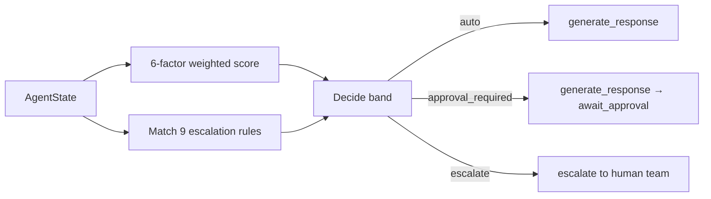

# ShopEase Agentic AI — Final Presentation Outline (Rohan (Person 5))

This is the slide-by-slide narrative for the final demo. Rohan (Person 5) owns
slides 13-20. The rest are placeholders for teammates.

Drop the numbers from `tests/evaluation/report_v1.md` (pre-Person-3) and
`tests/evaluation/report_v2.md` (post-Person-3) into slides 15-16 once
both runs exist.

---

## Deck structure (15-20 slides)

| # | Slide | Speaker | One-line content |
|---|-------|---------|------------------|
| 1 | Title + team | Ashish (Person 1) | ShopEase Agentic AI · 5-person team · roles |
| 2 | Business problem | Ashish (Person 1) | Fragmented context, slow resolution, churn |
| 3 | Why agents (vs single LLM) | Ashish (Person 1) | Modularity, safety, explainability |
| 4 | High-level architecture | Ashish (Person 1) | Mermaid diagram from README |
| 5 | Agent collaboration flow | Ashish (Person 1) | Sequence diagram for one scenario |
| 6 | Knowledge grounding | Gunjan (Person 2) | Policy KB structure + retrieval |
| 7 | Policy retrieval demo | Gunjan (Person 2) | Live RAG on coupon issue |
| 8 | Mock integrations | Pallavi (Person 3) | Order/Payment/Logistics APIs |
| 9 | Workflow automation demo | Pallavi (Person 3) | Return initiated end-to-end |
| 10 | Customer chat UI | Aditi (Person 4) | Live chat window |
| 11 | Agent assist console | Aditi (Person 4) | Right-pane: intent, sentiment, policy, risk |
| 12 | Product Advisory feature | Aditi (Person 4) | Compare-two-products with use case |
| **13** | **Escalation & risk model** | **Rohan (Person 5)** | **6-factor weighted matrix + 3 bands** |
| **14** | **Human-in-the-loop** | **Rohan (Person 5)** | **Approval queue + audit + override** |
| **15** | **Evaluation methodology** | **Rohan (Person 5)** | **25 cases + 70 perturbations + metrics** |
| **16** | **Live metrics** | **Rohan (Person 5)** | **Pass rate · precision · recall · latency** |
| **17** | **Business impact** | **Rohan (Person 5)** | **Hours saved / week, deflection %** |
| **18** | **Responsible AI** | **Rohan (Person 5)** | **Audit log, SLA, override path** |
| **19** | **Limitations** | **Rohan (Person 5)** | **Mock data, single language, no live integrations** |
| **20** | **Roadmap + Q&A** | **Rohan (Person 5)** | **Production migration table from README** |

---

## Rohan (Person 5) slide details

### Slide 13 — Escalation & risk model

- The risk agent is **not a single `if`-statement** — it's a 6-factor weighted matrix.
- Show the table from [src/agents/escalation_risk.py](../src/agents/escalation_risk.py) (the `WEIGHTS` dict):

| Factor | Weight | Signal |
|--------|-------:|--------|
| Sentiment | 0.25 | angry > negative > neutral > positive |
| Order value | 0.20 | INR thresholds: 10k / 5k / other |
| Intent confidence | 0.15 | < 0.4 = very low; < 0.7 = moderate |
| Customer tier | 0.10 | VIP > premium > regular |
| Repeated contact | 0.15 | 3+ CRM notes = high |
| Issue severity | 0.15 | damaged > delivery > refund > tracking |

- Three outcome **bands**:
  - `auto` — AI answers directly.
  - `approval_required` — AI drafts, **human approves** before customer sees it (HITL).
  - `escalate` — AI is taken out of the loop; human team takes the case.
- Mermaid that fits on a slide:



### Slide 14 — Human-in-the-loop

- Show [src/governance/approval_queue.py](../src/governance/approval_queue.py).
- One-line CLI demo:

```bash
python -m src.governance.approval_queue list --status pending
python -m src.governance.approval_queue approve APR-A1B2C3D4 --note "LGTM"
```

- Talking points:
  - Every borderline (0.40 ≤ score < 0.70) request is **drafted** but **queued** — never auto-sent.
  - P1 routes (fraud, angry high-value) force `escalate` regardless of score — AI cannot answer.
  - JSONL persistence + idempotent decisions = safe to crash mid-review.
  - `APPROVAL_AUTO_APPROVE=true` for the demo so the live flow doesn't stall.

### Slide 15 — Evaluation methodology

- 25 hand-crafted cases in [tests/evaluation/test_cases.json](../tests/evaluation/test_cases.json), distributed:
  - 10 routine, 5 escalation, 5 edge case, 5 negative ("must-not-promise" guard).
- 70 auto-generated **perturbations** (10 routine cases × 7 mutators) in [tests/evaluation/perturbations.py](../tests/evaluation/perturbations.py).
- Metrics computed in [tests/evaluation/run_evaluation.py](../tests/evaluation/run_evaluation.py):
  - intent accuracy, escalation precision, escalation recall, false-escalation rate,
    pass rate by category, avg quality score, avg response confidence, avg latency.
- All metrics flow from the **audit log** ([src/governance/audit.py](../src/governance/audit.py)) — same code path as production.

### Slide 16 — Live metrics (fill in from report files)

Pull these tables directly from [tests/evaluation/report_v1.md](../tests/evaluation/report_v1.md) (pre-Person-3 baseline). After Pallavi (Person 3) lands, regenerate as `report_v2.md` and show **both** side by side.

| Metric | v1 (mock) | v2 (with P3 data) | Target |
|--------|----------:|------------------:|-------:|
| Pass rate (25 cases) | _from report_v1.md_ | _to be filled_ | > 85% |
| Intent accuracy | _from report_v1.md_ | _to be filled_ | > 85% |
| Escalation precision | _from report_v1.md_ | _to be filled_ | > 80% |
| Escalation recall | _from report_v1.md_ | _to be filled_ | 100% (P1/P2) |
| False escalation rate | _from report_v1.md_ | _to be filled_ | < 10% |
| Avg quality score | _from report_v1.md_ | _to be filled_ | > 0.85 |
| Avg latency (ms) | _from report_v1.md_ | _to be filled_ | < 100 |

### Slide 17 — Business impact

- Frame as deflection × cost-per-ticket × volume.
- Use the band distribution from the eval to project deflection:
  - `auto` band % → AI-handled tickets (zero human cost).
  - `approval_required` % → human spends ~30 seconds reviewing (vs ~5 min writing).
  - `escalate` % → routes to the right team first-time (vs 2-3 hops).
- ShopEase background numbers from the README: thousands of daily interactions; assume baseline 8-min average handle time.

### Slide 18 — Responsible AI

- **Grounding**: every factual claim cites a `POL-` reference.
- **Explainable risk**: agent console shows the 6 factors and their contributions.
- **Audit trail**: append-only JSONL, every session captured (escalate / approval / auto).
- **HITL gate**: never auto-acts on borderline cases; SLA timestamp on every escalation.
- **Override path**: `human_override` flag in the audit lets QA flag bad decisions for retraining.

### Slide 19 — Limitations

- Mock data only — `MOCK_ORDERS`, `MOCK_CUSTOMER_ORDERS` in [src/agents/order_context.py](../src/agents/order_context.py).
- English-only intent classifier; perturbation report shows degradation on mixed-language inputs.
- Synchronous approval queue (no live UI for reviewer yet — CLI only).
- Risk thresholds are hand-tuned, not learned from labelled escalations.
- Single LLM (no model routing for cost optimization).

### Slide 20 — Roadmap

Pull the production migration table from the README ("Production Roadmap" section):

| Prototype | Production |
|-----------|-----------|
| JSON files | Azure Cosmos DB |
| Keyword matching | Azure AI Search |
| OpenAI API | Azure OpenAI Service |
| Local JSONL | PostgreSQL + Audit dashboard |
| In-memory | Redis |
| `python -m src.main` | Azure App Service + Container Apps |

Plus Rohan (Person 5) additions:
- Reviewer web UI for the approval queue.
- Slack / Teams hook so escalations notify the on-call team automatically.
- Active-learning loop: human_override entries feed back into intent / risk training.

---

## Demo script (5 minutes live)

| Time | Step | What to show |
|------|------|--------------|
| 0:00 | Open agent console | Aditi (Person 4)'s right-pane view |
| 0:30 | Routine query — order tracking | `auto` band, fast response |
| 1:00 | Return request | Workflow initiates, policy cited |
| 2:00 | Damaged VIP high-value | `escalate` band, P1 routing, SLA on screen |
| 3:00 | Borderline case (lost shipment) | `approval_required` band → CLI approval |
| 4:00 | Show audit log + report | `python -m tests.evaluation.run_evaluation` summary |
| 4:30 | Wrap with metrics slide | v1 vs v2 numbers |

---

## Pre-demo checklist (Rohan (Person 5))

- [ ] `pytest tests/test_escalation.py` — all green
- [ ] `python -m tests.evaluation.run_evaluation` — < 10 failing cases
- [ ] `python -m tests.evaluation.perturbations` — pass rate > 70%
- [ ] `logs/audit.jsonl` cleared then repopulated by a full demo run
- [ ] `APPROVAL_AUTO_APPROVE=true` exported for the live walkthrough so HITL flow completes on stage
- [ ] Reviewer terminal pre-warmed with `python -m src.governance.approval_queue list`
- [ ] Slides 13-20 reviewed by Ashish (Person 1) for narrative consistency
