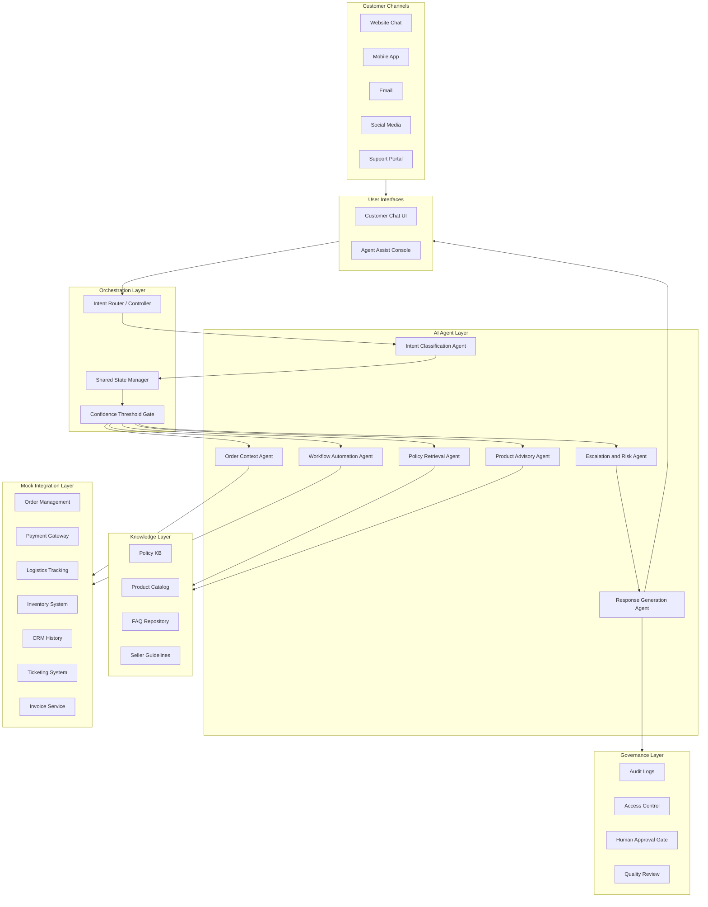
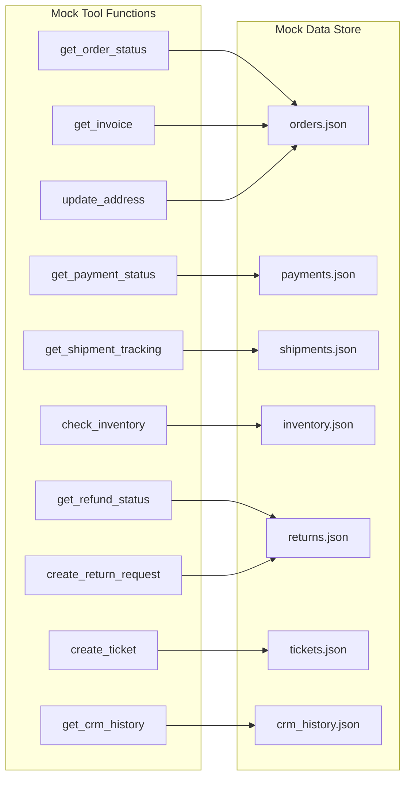
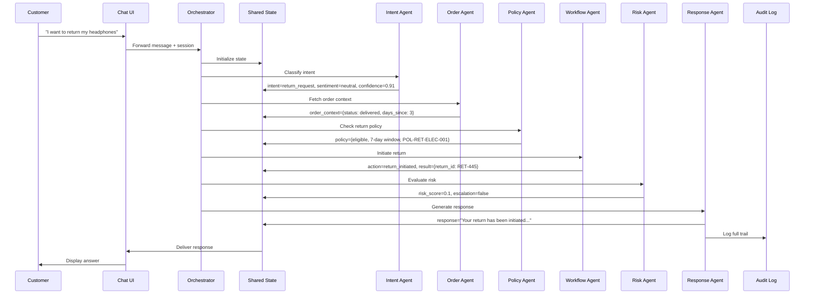

# System Architecture — ShopEase Agentic AI Support

## 1. Architecture Overview

The system follows a **multi-agent orchestration** pattern where a central router coordinates specialized AI agents. Each agent handles a distinct responsibility and communicates through a shared state object.



## 2. Orchestration State Schema

The shared state object flows through the entire agent pipeline. Every agent reads from and writes to this state.

```python
@dataclass
class OrchestrationState:
    # Input context
    session_id: str
    customer_id: str
    channel: str                    # web | mobile | email | social | portal
    message: str
    conversation_history: list[dict]

    # Intent Classification output
    intent: str                     # order_tracking | return_request | refund_status |
                                    # product_inquiry | warranty | coupon_issue |
                                    # delivery_complaint | damaged_product | general_faq
    sub_intent: str | None
    sentiment: str                  # positive | neutral | negative | angry
    urgency: str                    # low | medium | high | critical
    intent_confidence: float        # 0.0 - 1.0

    # Order Context output
    order_context: dict | None      # unified order/payment/shipment/CRM summary
    order_id: str | None
    customer_tier: str | None       # regular | premium | vip

    # Policy Retrieval output
    policy_snippets: list[dict]     # [{rule, explanation, reference_id, confidence}]
    policy_applies: bool

    # Product Advisory output
    product_context: dict | None    # comparison table, recommendations, alternatives

    # Workflow Automation output
    action_taken: str | None        # return_initiated | ticket_created | invoice_sent | etc.
    action_result: dict | None
    requires_human_approval: bool

    # Escalation & Risk output
    risk_score: float               # 0.0 - 1.0
    escalation_required: bool
    escalation_reason: str | None
    target_team: str | None         # logistics | refund_specialist | fraud | replacement | senior_agent
    priority: str                   # P1 | P2 | P3 | P4

    # Response Generation output
    response_text: str | None
    response_confidence: float
    references_cited: list[str]
    suggested_next_action: str | None

    # Governance
    agents_called: list[str]
    timestamp: str
    audit_trail: list[dict]
```

## 3. Agent Contracts

### 3.1 Intent Classification Agent

| Field | Value |
|-------|-------|
| **Owner** | Person 1 |
| **Input** | `message`, `channel`, `conversation_history` |
| **Output** | `intent`, `sub_intent`, `sentiment`, `urgency`, `intent_confidence` |
| **Tools** | Intent label set, sentiment rules |
| **Escalation Trigger** | `intent_confidence < 0.6` OR `sentiment == "angry"` |

**Supported Intents:**
- `order_tracking` — where is my order, delivery status
- `return_request` — want to return, exchange
- `refund_status` — refund not received, refund timeline
- `product_inquiry` — product comparison, availability, specs
- `warranty` — warranty claim, coverage check
- `coupon_issue` — coupon not applied, discount query
- `delivery_complaint` — late delivery, wrong address
- `damaged_product` — received broken/defective item
- `general_faq` — store hours, payment methods, account help

### 3.2 Order Context Agent

| Field | Value |
|-------|-------|
| **Owner** | Person 3 |
| **Input** | `customer_id`, `order_id`, `intent` |
| **Output** | `order_context` (unified summary) |
| **Tools** | `get_order_status`, `get_payment_status`, `get_shipment_tracking`, `get_crm_history`, `get_return_status` |
| **Escalation Trigger** | Missing/contradictory data, payment dispute detected |

**Output Schema:**
```json
{
  "order_id": "SE10234",
  "status": "shipped",
  "items": [{"name": "Wireless Headphones", "qty": 1, "price": 2499}],
  "payment": {"method": "UPI", "status": "captured", "amount": 2499},
  "shipment": {"carrier": "BlueDart", "tracking": "BD98712", "eta": "2026-05-22"},
  "return_history": [],
  "crm_notes": ["Called about delivery delay on 2026-05-18"],
  "customer_tier": "premium"
}
```

### 3.3 Policy Retrieval Agent

| Field | Value |
|-------|-------|
| **Owner** | Person 2 |
| **Input** | `intent`, `order_context`, `message` |
| **Output** | `policy_snippets`, `policy_applies` |
| **Tools** | Policy KB (vector search / keyword match), FAQ repository |
| **Escalation Trigger** | Policy ambiguity, restricted/seller-specific cases |

**Output Schema:**
```json
{
  "policy_snippets": [
    {
      "rule": "Electronics can be returned within 7 days of delivery if unopened.",
      "explanation": "Product is eligible for return as delivery was 3 days ago.",
      "reference_id": "POL-RET-ELEC-001",
      "confidence": 0.92
    }
  ],
  "policy_applies": true
}
```

### 3.4 Product Advisory Agent

| Field | Value |
|-------|-------|
| **Owner** | Person 4 |
| **Input** | `message`, product names/filters, `intent` |
| **Output** | `product_context` (comparison, recommendation, alternatives) |
| **Tools** | Product catalog, inventory mock API |
| **Escalation Trigger** | Medical/legal product claims, low confidence |

### 3.5 Workflow Automation Agent

| Field | Value |
|-------|-------|
| **Owner** | Person 3 |
| **Input** | `intent`, `order_context`, `policy_snippets` |
| **Output** | `action_taken`, `action_result`, `requires_human_approval` |
| **Tools** | `create_return_request`, `get_refund_status`, `download_invoice`, `create_ticket`, `update_address` |
| **Escalation Trigger** | Sensitive financial action, missing proof/evidence |

**Available Workflows:**
| Workflow | Trigger Intent | Action |
|----------|---------------|--------|
| Return Initiation | `return_request` | Validate eligibility, create return |
| Refund Lookup | `refund_status` | Check payment gateway status |
| Invoice Download | `order_tracking` | Generate and send invoice link |
| Ticket Creation | Any escalated | Create support ticket with context |
| Address Correction | `delivery_complaint` | Update shipping address if possible |

### 3.6 Escalation & Risk Agent

| Field | Value |
|-------|-------|
| **Owner** | Person 5 |
| **Input** | `message`, `order_context`, `risk_score`, `intent_confidence`, `sentiment` |
| **Output** | `escalation_required`, `escalation_reason`, `target_team`, `priority` |
| **Tools** | Risk matrix, priority rules, routing map |
| **Escalation Trigger** | Always evaluates; routes when conditions met |

**Risk Rules:**
| Condition | Priority | Target Team |
|-----------|----------|-------------|
| `sentiment == "angry"` AND `order_value > 5000` | P1 | Senior Agent |
| Fraud suspicion (duplicate refund, stolen card) | P1 | Fraud Review |
| Payment dispute (chargeback, failed refund) | P2 | Refund Specialist |
| Damaged high-value product (> 10000) | P2 | Replacement Team |
| Lost shipment | P2 | Logistics + Fraud |
| `intent_confidence < 0.4` | P3 | Senior Agent |
| Repeated contact (3+ times same issue) | P3 | Escalation Queue |

### 3.7 Response Generation Agent

| Field | Value |
|-------|-------|
| **Owner** | Person 1 + Person 4 |
| **Input** | All agent outputs from state |
| **Output** | `response_text`, `response_confidence`, `references_cited`, `suggested_next_action` |
| **Tools** | Tone guidelines, response templates |
| **Escalation Trigger** | Unsupported claim, risky decision, missing evidence |

**Generation Rules:**
- Every factual claim must cite a `reference_id` from policy or order data
- Tone adapts to channel (formal for email, conversational for chat)
- Never promise what policy doesn't allow
- Include confidence score for agent-assist mode
- Flag if response contains any ungrounded statement

## 4. Integration Layer Design

All integrations are **mock APIs** returning structured JSON for the prototype.



**Tool Function Signature Pattern:**
```python
def get_order_status(order_id: str) -> dict:
    """Retrieve order details including items, status, and dates."""
    ...

def create_return_request(order_id: str, item_id: str, reason: str) -> dict:
    """Initiate a return request after eligibility check."""
    ...
```

## 5. Governance & Audit Layer

### Audit Log Entry Schema

```json
{
  "session_id": "sess_abc123",
  "timestamp": "2026-05-20T10:30:00Z",
  "customer_id": "CUST_5678",
  "intent_detected": "return_request",
  "agents_called": ["intent_classifier", "order_context", "policy_retrieval", "workflow_automation", "response_generation"],
  "policy_references": ["POL-RET-ELEC-001"],
  "action_taken": "return_initiated",
  "risk_score": 0.15,
  "escalation": false,
  "response_confidence": 0.89,
  "human_override": false,
  "resolution_time_ms": 2340
}
```

### Human Approval Gates

Actions that require human confirmation before execution:

| Action | Reason | Approval Team |
|--------|--------|---------------|
| Refund > 5000 | Financial threshold | Finance |
| Override policy exception | Non-standard resolution | Senior Agent |
| Account suspension | High-impact action | Compliance |
| Fraud flag confirmation | Potential false positive | Fraud Review |

## 6. Confidence Thresholds

| Threshold | Value | Action |
|-----------|-------|--------|
| Intent confidence - proceed | >= 0.7 | Route to appropriate agent |
| Intent confidence - low | 0.4 - 0.7 | Proceed but flag for review |
| Intent confidence - fail | < 0.4 | Escalate to human agent |
| Policy match confidence | >= 0.8 | Use in response |
| Response confidence - serve | >= 0.75 | Deliver to customer |
| Response confidence - draft | 0.5 - 0.75 | Show as suggestion to support agent |
| Response confidence - reject | < 0.5 | Do not serve, escalate |

## 7. Data Flow Summary


